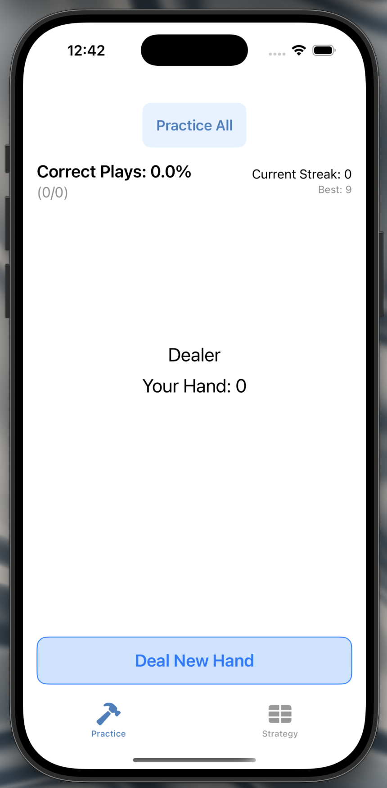
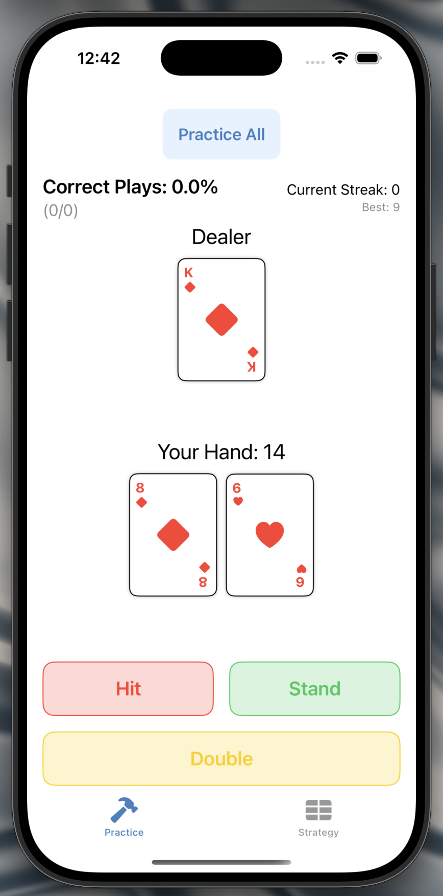
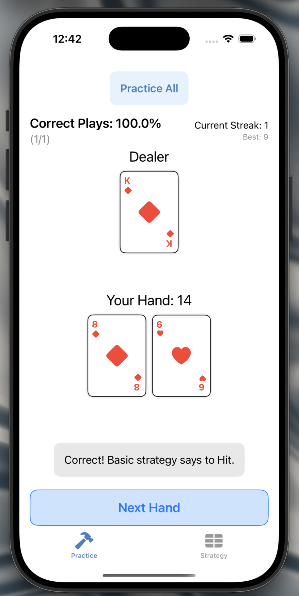
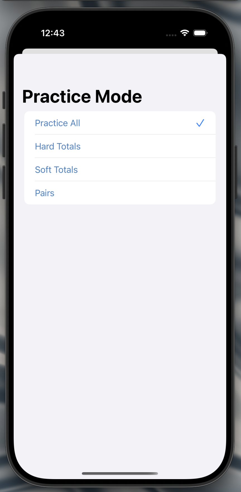

 # Blackjack Trainer Mobile

## Overview
Blackjack Trainer Mobile is an iOS application designed to help users improve their blackjack skills using basic strategy. The app offers a clean and interactive interface where players can practice decision-making based on blackjack strategy charts and track their performance over time.

## Features
- **Practice Mode:** Users can practice different aspects of blackjack strategy including:
  - Practice All
  - Hard Totals
  - Soft Totals
  - Pairs
- **Strategy Chart:** A complete strategy chart is included for reference, showing optimal plays based on the player's hand and dealer's upcard.
- **Performance Tracking:** The app tracks the player's streak and accuracy over multiple practice sessions.
- **User-Friendly Design:** Clean, minimalistic design with easy navigation between practice and strategy tabs.

## Screenshots
Here are some screenshots showcasing the app's features (resized for better readability):










## Installation
1. Clone the repository:
   ```bash
   git clone https://github.com/noahschlorf/Blackjack-Trainer-Mobile.git
   ```
2. Open the project in **Xcode**.
3. Build and run the app on a simulator or physical device.


Improve your blackjack game with **Blackjack Trainer Mobile** today!


